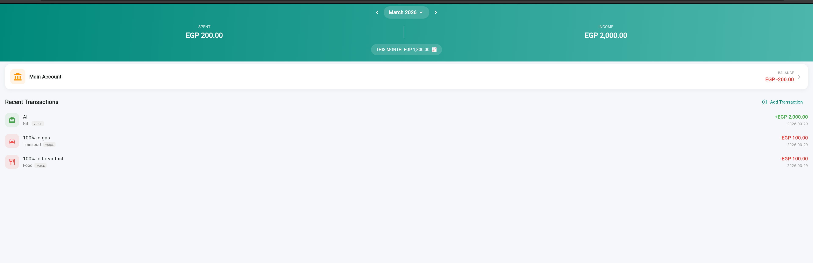
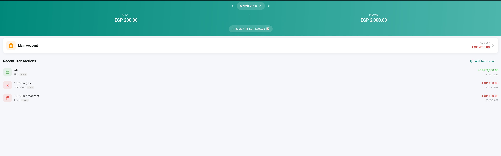

# Money Tracker App - Setup Guide (Windows)

## Step 1: Install Flutter SDK

1. Download Flutter SDK from: https://docs.flutter.dev/get-started/install/windows/mobile
2. Extract the zip to `C:\flutter` (or your preferred location)
3. Add Flutter to your PATH:
   - Open **System Properties** > **Environment Variables**
   - Under **User variables**, edit `Path` and add `C:\flutter\bin`
4. Open a new terminal and verify:
   ```
   flutter --version
   ```

## Step 2: Install Android Studio

1. Download from: https://developer.android.com/studio
2. Run the installer with default options
3. On first launch, let it download the Android SDK
4. Go to **SDK Manager** > **SDK Tools** and ensure these are installed:
   - Android SDK Build-Tools
   - Android SDK Command-line Tools
   - Android SDK Platform-Tools
5. Accept Android licenses:
   ```
   flutter doctor --android-licenses
   ```

## Step 3: Verify Installation

```
flutter doctor
```

You should see checkmarks for Flutter and Android toolchain. You can ignore Chrome/Visual Studio items since we only need Android.

## Step 4: Set Up the Project

Open a **PowerShell terminal** in the `money_tracker` folder and run these commands in order:

```powershell
cd C:\Users\Ramy\Desktop\money_tracker

# Generate Android platform files around existing source code
flutter create --org com.ramy --project-name money_tracker .

# Configure Android permissions for SMS, microphone, etc.
powershell -ExecutionPolicy Bypass -File setup_android.ps1

# Install all dependencies
flutter pub get
```

## Step 5: Build the APK

Generate a release APK:

```
flutter build apk --release
```

The APK will be at:
```
build\app\outputs\flutter-apk\app-release.apk
```

If you want a smaller APK for a specific architecture (recommended):
```
flutter build apk --release --split-per-abi
```
This creates separate APKs. For most modern phones, use the `arm64-v8a` version.

## Step 6: Install on Your Phone

1. Connect your Android phone via USB
2. Enable **Developer Options** on your phone:
   - Go to Settings > About Phone > tap **Build Number** 7 times
3. Enable **USB Debugging** in Developer Options
4. Transfer the APK file to your phone
5. On the phone, open the APK and tap **Install**
   - You may need to enable "Install from Unknown Sources" for your file manager

## Alternative: Direct Install via ADB

If you have ADB set up (comes with Android Studio):

```
adb install build\app\outputs\flutter-apk\app-release.apk
```

## Troubleshooting

- If `flutter doctor` shows issues, follow the suggested fixes
- If SMS permission is denied at runtime, go to phone Settings > Apps > Money Tracker > Permissions > SMS > Allow
- The app needs "Background activity" permission for SMS auto-tracking to work when the app is closed

## SMS Auto-Tracking — Background / App-Closed Behavior

The app processes incoming bank SMS via an Android `BroadcastReceiver`. The
OS wakes the receiver up for every incoming SMS even when the app process
is killed; the receiver then spawns a Flutter background isolate that
parses the message and writes the transaction directly to the local
SQLite database (no UI required).

For this to work reliably you must do two things on the phone after
installing the app:

1. **Grant SMS + Notification permissions** the first time you toggle SMS
   tracking on. If you accidentally denied them, go to:
   **Settings > Apps > Money Tracker > Permissions** and allow `SMS` and
   `Notifications`.

2. **Disable battery optimization** for Money Tracker. Aggressive OEMs
   (Samsung, Xiaomi, Oppo, Huawei) will otherwise stop spawning the
   background isolate after a few hours of inactivity. The path varies:
   - Samsung: **Settings > Apps > Money Tracker > Battery > Unrestricted**
   - Stock Android / Pixel: **Settings > Apps > Money Tracker > Battery >
     Unrestricted**
   - Xiaomi (MIUI): **Settings > Apps > Manage Apps > Money Tracker >
     Battery saver > No restrictions** AND enable **Autostart**
   - Oppo / Realme: **Settings > Battery > App battery management > Money
     Tracker > Allow background activity**

In the app: open **Settings > SMS Auto-Tracking** and pick the **Account**
and **Categories** that auto-saved transactions should be assigned to.
These choices are persisted to `SharedPreferences` so the background
isolate can read them when the main app isn't running.

Auto-saved transactions are flagged `needsReview = true` so you can review
and correct them later from the Wallet screen.
